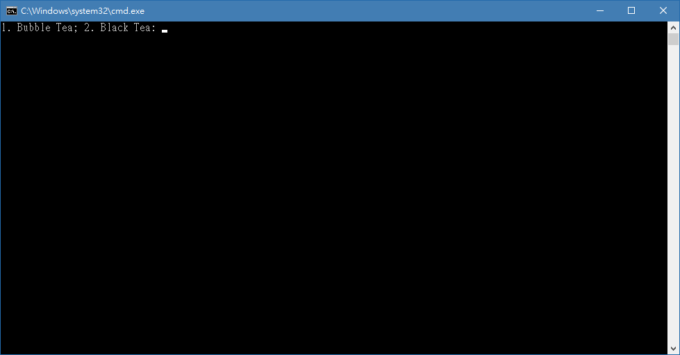
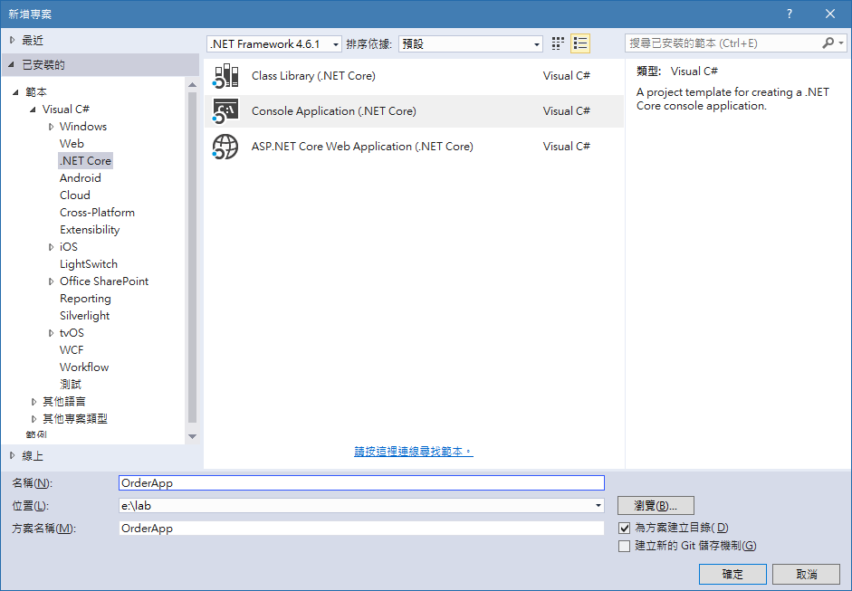

% 從珍珠奶茶開始

如果我們抬起頭來看看街上的飲料店，會發現這是一個很了不起的成就，因為不但選擇多樣而且價格實惠，但是如果我們要進一步發展，就會遇到很多瓶頸，主要原因當然是原料取得不易，和人工越來越昂貴所導致。因為我們必須要趕上其他行業的發展，也必須要理解世界上沒有永遠的隔閡距離，因此如果我們不願意進步，很快就會遇到真實的挑戰。

要發展首先從內部做起，如果我們要製作一個簡單的銷售程式，也就是記錄總共賣了幾杯珍珠奶茶，方式有很多種，但是眼前這一種可以幫助我們從遠端連線觀察銷售情況，也可以往手機發展，甚至可以轉變成公開的訂購網站，可以說是相當好的出發點，不如我們現在就開始製作飲料店的管銷程式。

# 程式即是可執行的網站

網路核心（.Net Core）的一個最大特點就是它自己就是一個完整的程式，同時也是一個網路服務功能導向的工具，我們可以輕鬆的建立完整的網站而不需要再藉助其他的網站伺服器，尤其是當我們想要使用家裡的舊電腦來做這個管理站時，更是可以輕鬆將做好的軟體複製到任何一台電腦上，就可以馬上執行變成工作站。我們必須要知道，任何一個軟體最困難的不是開發，而是維護工作，如果這個軟體仰賴太多外在的結構才能運作，我們的維護工作就會日益困難，相反的，在使用網路核心開發的軟體或網站，它自己就可以是單獨存在的狀態，當然對於我們來說就是相當好的條件。

傳統的網站，不論靜態或是動態，除了準備好網頁的部分之外，還需要電腦安裝網站伺服器，常見的有阿帕契（Apache）、網際網路資訊服務器（IIS）和引擎 X（nginx），以前自己架設網站時處理好這個伺服器系統就是一大問題，然而，網路核心就自己準備好了一個伺服器系統，叫做紅隼（Kestrel）伺服器，當我們自己內部使用時，第一選擇就是這個快速方便的紅隼伺服器。

如果我們要將網站放在遠端的伺服器電腦上，那大多數都要有更完整的伺服器程式才可以使用，那個就不是本指引會探討的內容，相對也是比較複雜的技術，需要更多的經驗和幫忙才能完成。

# 管理檔案的建立

程式設計並不會完全取代我們原先具備的好用軟體，我們也不應該期待在短時間內就可以完全自己製造全部需要的東西，不是嗎？最好的辦法是兩者兼具，用原本好用的軟體做原本就做得很好的事情，用程式設計來加強所需要的功能，和預防嚴重失誤的情況，是最常見的兩大好處。首先，我們要用試算表（Excel）來設計所需要的管銷清單，如果原先就有其他的試算表檔案最好不要直接拿來使用，才不會造成自己的麻煩，譬如誤刪或設計困難，而是重新製作一個簡單的檔案來方便後續的處理。

首先在試算表中輸入代表編號、項目、數量、時間、小計的英文（id, item, quantity, date, subtotal），然後存成逗號分隔的檔案（.csv），當作我們的資料庫儲存格式，如+@fig:data-csv。

{#fig:data-csv}

如果沒有試算表程式，也可以打開筆記本軟體，直接在第一行輸入沒有任何空格在內的 `id,item,quantity,date,subtotal`，存成 `data.csv`，編碼記得選擇 UTF-8。或者直接從這裡[下載檔案](_static/data.csv)也是一樣的。

目前如果只是在內部使用，不會有很多人同時連上我們的程式時，這樣子的格式檔案就是相當好用的選擇，但是要開發成中大型軟體時，這樣子的格式就會有連線上的問題了，不過，我們就以這個來前進就行了。

之所以要使用英文代號當作每欄的標題名稱是因為程式設計的方便性以及減少錯誤的可能，未來要使用大型資料庫軟體時，也會比較容易轉換，所以建議使用簡單的英文來操作這個設定。

也要記得這個試算表的檔名只是`data`而已，但是作為安全的第一課，資料庫檔案是最重要的資料，如果我們放在網站上是如此簡單的檔案名稱時，很有可能隨便的人都可以輕鬆在網址上測試輸入而獲取整個檔案，不過這不是眼前最重要的問題，只是要知道在學習的剛開始，我們不用著急，但這個並不是安全的作法。

# 程式設計的根基：類別

如果說物理的最小粒子是分子的話，那程式設計的分子就是類別。當我們從剛剛的試算表出發時，馬上就要知道程式設計的第一步就是建立一個代表剛剛試算表中的每一列資料的元件，也就是要用程式來存取資料時，我們必須要使用的工具就是一個類別。

在網路核心中，類別的建立很容易，我們開啟一個筆記本檔案，在裡面輸入以下幾行字：

我們已經完成了一個簡單的類別，而且這個程式已經完成了。並不是全部的程式都需要很多檔案，或者很複雜的機轉才能執行，不過，如果我們要執行這個檔案，還需要一點點功夫，那就是幫它設定一個專案。在開啟剛灌好 Visual Studio 2015 的時候，我們來研究一下剛剛寫完的這個程式。

第一行到第六行都是固定寫法，真正的關鍵在第七行`Console`才開始，也就是說，當我們使用程式時總是會有一個平台，當平台是主控台時，這個主控台的控制名稱就是`Console`。而主控台就是下方這個黑漆漆的東西。

當然我們並不會真的持續在這個主控台上面研發軟體，但是這是一個最簡單的介面，也就是輸出、輸入這兩件事情，再複雜的程式都是由這兩件事情所組成的。第七行的意思就是叫主控台顯示 `1. Bubble Tea; 2. Black Tea: ` 這一串文字，表示說輸入1就是珍奶，輸入2就是紅茶。而第八行的意思就是要主控台等待使用者輸入一個鍵，如果使用者任意按下鍵盤上的任何一個按鈕，這個程式就結束了。再過來我們研究第五行，這是一個古代的寫法，也就是告訴系統說這個地方是入口，如果有很多檔案或程式碼的軟體，系統第一個仍會找到這個名稱為`Main`的地方開始執行，而這個由大刮號所組成的區域（第六到第九行）就是這個`Main`的全部內容，再往前一點有一個稱為`Program`的東西，也就是我們今天的主角 — 類別。

類別就是以關鍵字 `public class` 開頭的敘述文字段落，裡面主要由方法和欄位所組成，剛剛看到的`Main`就是一個方法，而欄位則是資料類型，在上面這個程式中還沒見到，也不是我們今天的重點。類別好像很難理解，但是它就是程式的本身概念，也就是運算這件事情，好比說加法需要有兩個數字和一個加號，而加號就是方法，數字就是欄位，而這樣的程式類別就可以稱之為加法。

# 開啟第一個專案

當我們要開發大型專案時，使用筆記本就稍嫌吃力，從現在開始我們都會使用 Visual Studio 來當作我們主要的工具，打開它之後，我們在左上角的檔案選單中點選新增專案，然後在跳出來的視窗中，我們找到左側欄中的範本裡面的網路核心（.Net Core），並且點選主控台程式（Console Application），在下方名稱欄中改為 OrderApp，參考+@fig:NewProj-OrderApp。

{#fig:NewProj-OrderApp}

我們點選確定之後，就會在畫面中顯示出 Program.cs 的檔案，但是在類別 `Program` 中的方法 `Main` 裡面卻沒有任何東西，將剛剛我們在筆記本中打好的內容覆蓋到這個檔案裡面，按下按鈕 `F5`，不一會兒就會跳出來主控台畫面，顯示著閃動的游標要我們輸入文字，隨便按下1或2，或其他的字母按鍵，這個畫面就會自己消失了。恭喜你，完成了第一個可以運作的程式。如果有任何問題，請在下方留言大家討論切磋。

.. rubric:: 其他參考網站

- 類別是什麼和其中的成員簡介可以參考[微軟的官方文件-類別(C# 程式設計手冊)](https://msdn.microsoft.com/zh-tw/library/x9afc042.aspx)
- 還可以參閱[維基百科的物件導向程式設計](https://zh.wikipedia.org/wiki/%E9%9D%A2%E5%90%91%E5%AF%B9%E8%B1%A1%E7%A8%8B%E5%BA%8F%E8%AE%BE%E8%AE%A1)
