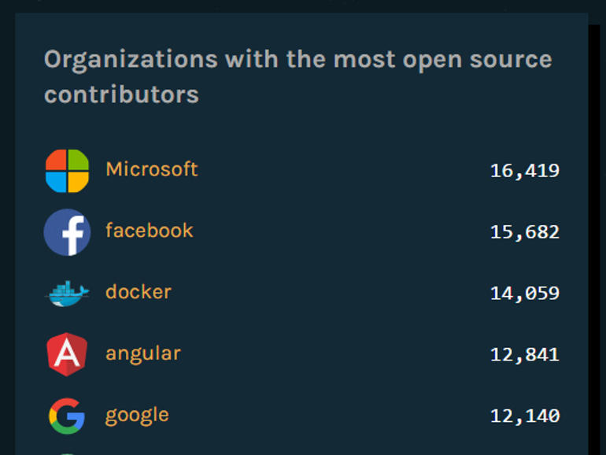
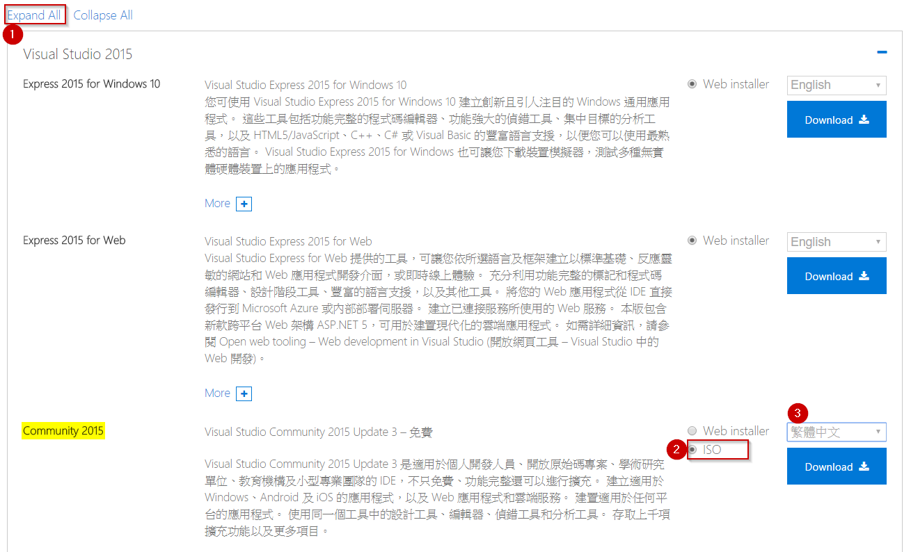

% 入門指引

從網路發展開始，線上購物一直都是熱門技術，早在西元1994年首批在網路上販售東西的店家就有必勝客，那個時候人們就已經可以直接網購匹薩。過了二十多年的今天，技術不斷進步，寫網頁不再是困難的事情，但是要如何操作與選擇，反倒是現今世代的難題。

\

隨便到書店走一遭，琳瑯滿目的是各式各樣不同的主題方法，不論是從 PHP、JAVA、Python、Perl，非常多種技術都可以幫助使用者達到架設線上訂購網站的目標，但是真的可以兼顧不斷更新內容和維護網站架構的方法卻是相對少見，或者當使用者想要擴充手機平板的訂購功能，甚至設計相對應的手機應用程式 App 時，就不是任何技術都可以無縫接軌、學一個打十個，方便延伸的好技術了。

好的技術需要強大的支援，好的人力也需要有充足的休息，隨便找一個技術去學習，只會浪費時間與精力，好比隨便找一個工作賺錢，只會累壞自己。重點是要懂得利用手邊的資源去操作有力的工具，幫助自己達到想要的目標。現在的電腦正是被大家給忽視的強大工具，只要學習少量的技術，就可以把電腦從上網聽音樂的家具變成現成的機器人，何樂而不為呢？

# 為什麼是網路核心？

很多人討厭微軟的強大與壟斷，所以喜歡採用其他免費的技術來達成相同的功能，或者轉而使用更昂貴的蘋果產品，但是當今天我們從簡單的使用者變成開發者的時候，還要考慮更多的困難與議題，譬如：

- 相關文件的完整度
- 線上資源的獲取方法
- 相關格式的接納度
- 開發工具的支援

雖然微軟有相當多的問題，產品也不總是最合理最開放，然而近一年來的確有相當大的改善，包括在2016年開放原始碼網站 GitHub 上被評比為第一名，或是在熱門技術的社群互動上，都可以看見全新的策略方針與努力付出。而目前我們要採用的技術，網路核心（.Net Core）便是一個最佳的例子。

早從西元2000年開始便出現的動態網頁技術「動態伺服器網頁（ASP）」一直都是網路上熱門的架站技術，經過 ASP 後繼者 Asp.Net 一代到四代的歷練，十多年的發展時間，微軟於西元2016年六月正式推出最新的完整技術不再叫做 Asp.Net 第五代，而是採用全新名稱「網路核心」第一代，有著下面三個關鍵要素：

1. 跨平台：不論開發者用 Windows、macOS 或 Linux，使用者在 PC、Mac、Linux、手機以及平板，都可以使用這個架構平台來開發軟體給在各種平台上的使用者來使用。
1. 全新架構：開發者寫完程式碼後所產生的應用程式可以在原有的「網際網路資訊服務器（IIS）」上運行，也可以單獨以完整封裝程式來執行。編譯網頁程式時不但可以在完整強大的開發軟體 Visual Studio 2015 上製作，也可以在多種命令列中操作，對於開發者來說不但可以按照自己習慣選擇，也可以加快開發速度。
1. 開放原始碼：這套平台架構從上游到下游全部開放原始碼，對於開發者來說，也就是將整套工具全部都免費放送的意思，而且也被微軟視為重點計畫來推廣發展至少十年以上，不用擔心之後會沒有協助或更新。

最重要的是，由於採用模組化的安排，只將所需要的元件放在程式中，並加上開發群和社群的共同努力，在相同的硬體上，測試出來的速度是 Node.js 的八倍快，是 Go 的三倍快。所以，對於身為開發者的我們，是目前最好的選擇。

# 目標是什麼？

在網路科技日益成熟的今天，過去沒有學習過相關技術的人不再需要從頭學起，只要有一台電腦和本篇指引，在短時間內就可以架設出自己的線上早餐店，不論是要從這個早餐店延伸服務到各行各業，或是深入技術到手機平板應用軟體，都會是相當容易的發展。

本指引的預設讀者是完全沒有任何程式設計的基礎，沒有網頁開發的技術經驗，然而如果有簡單網頁開發能力，會是更加容易入手的進階課程，可以使網頁從靜態提供資訊，變成動態接收使用者的回饋或訂單。需要寫程式的地方不少，但是好比學一個做菜，其實只是看起來很難，實際上一回生二回熟，最重要的是，按照指引的步驟操作，每一步邊看邊照做，不會比做一個漢堡還要困難的。

採用的技術也是業界相當成熟的程式語言 C#，不過，因為網路上已經有很多相關課程教學，所以我們在文章中只會簡單的提到相關語法，幫助讀者理解語意為目標，不會深入探討程式語言的技術。如果你願意，可以先找相關簡介文章理解什麼是 C#，以及它的簡單語法。本指引將著重在網頁技術的解釋，如果你放輕鬆跟著我們前進，不用害怕程式設計，也可以逐步學會 C# 的語法。

好比準備一個考試一樣，永遠都沒有完美的時候，學習一項技術並不是零或一的差別，沒有辦法標明什麼是學會的一天，但是只要你願意，永遠都是最佳的時機來進入一項新的技術學習，而且就這個剛發表第一代正式版的全新系統而言，不只是網頁設計的領域可以進入，同時也在學習一般程式設計，一箭雙雕是對於新手來說不可多得的好處。在這個時候，我們可以同時安裝開發軟體，同時來瞭解更多程式設計的簡單原則與概念。

# 安裝開發軟體

目前微軟提供最新最完整的程式開發軟體有免費的社群版本 Visual Studio Community 2015，在
[下載頁面](http://www.visualstudio.com/zh-hant/downloads/)中，不要直接點選「免費下載」，而是下載完整光碟映象檔（ISO），可以使安裝速度較快、錯誤機率較少，點選左下方的「檢視所有下載」 -> 「Expand All」 -> Community 2015這一欄右方點選 ISO -> 改成繁/簡體中文版本 -> Download。最新版本 2015 Update 3 的完整檔案大約有 7.1 GB，如果少於這個大小，有可能是下載到之前的版本。

## 軟硬體最低需求

微軟電腦作業系統要 Windows 7 SP 1 以上，硬體則是：

- 1.6 GHz 或更快的處理器
- 1 GB 的 RAM
- 4 GB 的硬碟容量
- 相容 DirectX 9 的顯示卡

如果你的電腦是使用 Mac 或 Linux，從現在開始也有很好的編輯器可以開發網路核心，從[Visual Studio Code 下載頁面](http://code.visualstudio.com/download)中，選擇相對應的版本來安裝，操作有些許不同，在本指引中將會以 Visual Studio 2015為主來示範。

## 安裝流程

1. 在下載好的檔案 vs2015.com_cht.iso 上點兩下來掛接光碟映象檔
2. 點開光碟中的 vs_community.exe
3. 在安裝過程中選擇預設，如+@fig:default，並點按安裝
4. 在 Visual Studio 2015 安裝完畢之後，下載並安裝最新的[網路核心（.Net Core）程式](http://go.microsoft.com/fwlink/?LinkID=827546)
5. 泡杯咖啡，回來就大功告成了

{#fig:default}

如果安裝遇到困難，個人經驗是多點選幾次重試就可以成功，或者先將作業系統重灌後再安裝，如果有其他問題可以在下方留言大家討論。

## 額外軟體

如果你安裝好最新版本的 Visual Studio和網路核心就可以繼續閱讀本指引，如果之後操作發現沒有相對應的版本，或顯示缺少某些版本，可以在這裡下載軟體：

### 網路核心 1.0.1 及 VS 2015 工具預覽 2.0.2

| 連結                                           |
|------------------------------------------------|
|http://go.microsoft.com/fwlink/?LinkID=827546   |

### 網路核心 1.0.1 SDK 1.0.0-工具預覽2-003131

| 平台         | 連結                                           |
|-------------|------------------------------------------------|
| Windows x64 | https://go.microsoft.com/fwlink/?LinkID=827524 |
| Windows x86 | https://go.microsoft.com/fwlink/?LinkID=827525 |

### 網路核心 1.0.0 SDK 1.0.0-工具預覽2-003121

| 平台         | 連結                                           |
|-------------|------------------------------------------------|
| Windows x64 | https://go.microsoft.com/fwlink/?LinkID=809122 |
| Windows x86 | https://go.microsoft.com/fwlink/?LinkID=809123 |

### 網路核心 1.0.0 RC2 SDK 1.0.0-工具預覽1-002702

| 平台         | 連結                                           |
|-------------|------------------------------------------------|
| Windows x64 | https://go.microsoft.com/fwlink/?LinkID=798398 |
| Windows x86 | https://go.microsoft.com/fwlink/?LinkID=798399 |

在安裝開發軟體以及需要的額外軟體時，不免需要相當長的時間，不如先參閱下面參考網站瞭解更詳細的介紹，或者是繼續閱讀本指引下一章的內容。

.. rubric:: 其他參考網站

- 開發軟體 Visual Studio 的介紹，請前往[官方網頁](https://www.visualstudio.com/zh-hant/)
- 詳細 Mac 或各種 Linux 的安裝，可以瀏覽[網路核心安裝網頁](https://www.microsoft.com/net/core)
